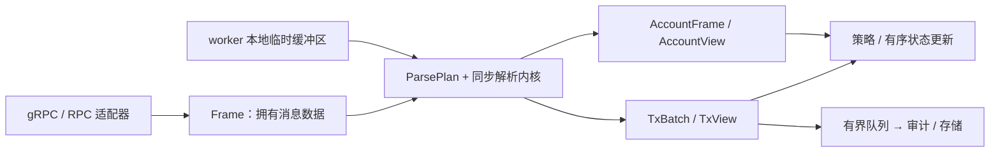

# 事件解析与流处理性能架构方案

- 状态：设计提案，新增类型和接口尚未实现。
- 日期：2026-09-09。
- 代码基线：`a63f80f`（`performance optimize`）。

本文建议保留现有协议解码逻辑，逐步重构事件模型、数据所有权和执行管线。目标是减少重复数据表示、临时分配和无关解析工作，同时控制积压内存与尾延迟。

核心设计是：**交易批次拥有数据，事件通过索引访问，按消费需求解析；同步解析内核与异步 I/O 分离。**

## 1. 当前基线与范围

基线已经完成以下优化：

- 事件通过所有权传递，移除了回调适配器和批量收集中的事件深拷贝、收集锁。
- gRPC 公钥表一次构造，供解析、Jito 检测、raw 指令收集和余额审计共享。
- CPI 指令通过借用视图访问原始账户索引和数据缓冲区。
- gRPC 收流路径直接移动包装对象的载荷；兼容对象池归还对象时不再分配替代 Box。
- 移除了 Shred 功能、相关客户端、协议代码、处理入口、示例和专用依赖。

已有[所有权与分配回归测试](../tests/parser_ownership.rs)验证了事件顺序、加载地址、raw 指令、余额审计、CU 归属和包装转换。在对应测试夹具中，48 个公钥的表仅分配一次，共 1,536 字节；三类包装转换无额外堆分配。这些结果不代表整个 gRPC 解码和事件解析过程零分配。

后续设计覆盖 gRPC/RPC 交易解析、账户解析、事件交付和指标采集。现有协议判别器、字段解码与语义规则继续复用。传输协议替换、生产端改造和多核调度属于后期可选项，由实际测量决定。

## 2. 结构性限制与证据

### 2.1 事件布局

以下为基线在 `rustc 1.97.1`、`x86_64-unknown-linux-gnu` 下的 `size_of` 结果。原型通过把账户事件和区块事件移出 `DexEvent` 生成交易枚举，保留全部现有交易事件载荷；原型未作为公开 API 合入。

| 类型或容器 | 大小 |
| --- | ---: |
| 当前 `DexEvent` | 11,744 字节 |
| 原型交易事件枚举 | 1,360 字节 |
| `EventMetadata` | 312 字节 |
| 当前 20 个 `DexEvent` 的元素存储空间 | 234,880 字节 |
| 原型 20 个交易事件的元素存储空间 | 27,200 字节 |

分离账户事件后，交易容器的元素存储空间约减少 88%。该结果不包含事件内部 Vec/String 的堆内存，也不表示吞吐或延迟提升 88%。Rust 类型布局会随类型定义、编译器和目标平台变化；每次迁移都需要重新测量。移动所有权也不保证机器码完全没有字节搬运，编译器可能消除部分移动。

### 2.2 优先处理的问题

| 优先级 | 当前限制 | 代码入口 | 设计方向 |
| --- | --- | --- | --- |
| 高 | 大账户快照和小交易事件共用最大尺寸的枚举 | [事件定义](../src/streaming/event_parser/core/traits.rs)，`DexEvent` | 分离交易、账户和控制事件；大载荷单独拥有 |
| 高 | raw 指令保存账户公钥、账户索引和数据，协议事件又保留其中一部分 | [交易解析](../src/streaming/event_parser/core/event_parser.rs)，`resolve_raw_dex_instruction`、`parse_event_from_grpc_instruction` | 原始指令保存一次，事件使用指令位置和账户索引 |
| 高 | CPI 按全部 inner instruction 数量预分配 `Vec<DexEvent>`，即使最终无匹配事件 | [交易解析](../src/streaming/event_parser/core/event_parser.rs)，`parse_instruction_events_from_grpc_transaction` | 使用紧凑事件记录；复用必要的暂存空间，保持交付顺序 |
| 高 | 首条 Program Data 和全部 Program Data 分别扫描、复制字符串，CU 又单独解析调用栈 | [Program Data 索引](../src/streaming/event_parser/common/program_data_index.rs)、[CU 索引](../src/streaming/event_parser/common/swap_cu.rs) | 一次扫描构建调用索引，日志只保存位置，按需解码 |
| 高 | 账户在完整解析后才过滤；交易 `should_handle` 忽略事件类型过滤器 | [账户解析](../src/streaming/event_parser/core/account_event_parser.rs)、[交易解析](../src/streaming/event_parser/core/event_parser.rs) | 在构造事件前执行解析计划与过滤判断 |
| 高 | 解析和用户回调直接运行在收流循环内，慢回调延迟后续消息与控制请求 | [gRPC 收流](../src/streaming/yellowstone_grpc.rs) | 明确同步消费与队列交付两种执行方式 |
| 中 | signature 内的开发者标记保存在共享表中，带来共享访问和清理 | [全局状态](../src/streaming/event_parser/core/global_state.rs) | 将交易内标记移入局部交易上下文 |
| 中 | 部分账户事件同时保存完整解码结构和原始字节 | [CLMM 账户解析](../src/streaming/event_parser/protocols/raydium_clmm/types.rs)等 | 提供账户借用视图，按访问模式选择解码与缓存 |
| 中 | 指标回调包装仍有每交易 Arc 构造，启用指标后有每事件原子更新 | [事件处理](../src/streaming/common/event_processor.rs)、[指标](../src/streaming/common/metrics.rs) | 订阅时选择指标实现，按 worker 或批次汇总 |

以上优先级依据布局实验和代码路径判断。真实负载下各项 CPU 占比、吞吐和 p99 收益尚待回放及 profiling 验证。

## 3. 目标架构



这里的 Frame 是适配器拥有的消息数据。第一阶段仍可使用现有 protobuf 解码结果，不要求直接引用网络接收缓冲区。解析内核负责校验、索引、字段解码和交易内推导；网络、重连、队列和持久化由外层负责。

| 组件 | 职责 | 生命周期 |
| --- | --- | --- |
| `TxFrame` / `AccountFrame` | 拥有适配后的原始消息数据 | 单次解析，或移动到输出批次 |
| `ParsePlan` | 固定本次订阅需要的输出与解析依赖 | 订阅级；配置变更时替换快照 |
| `ParserScratch` | 复用调用栈、索引、解码等临时空间 | worker 级，交易结束后复用 |
| `TxContext` | 维护当前交易的开发者标记、计算预算等上下文 | 交易级 |
| `TxBatch` | 拥有公共元数据、事件记录及按需保留的源数据 | 消费者决定 |
| `TxView` / `AccountView` | 借用数据进行同步读取 | 不超过所引用数据的生命周期 |
| 交付与状态应用层 | 管理背压、顺序及跨交易状态 | 消费者或执行管线级 |

## 4. 数据模型与所有权

### 4.1 交易、账户和控制事件分离

新增交易事件模型，不让账户数组决定交易事件的尺寸。交易事件内部继续使用静态枚举，保留清晰的协议分发。账户事件独立交付，按需持有原始缓冲区或已解码快照。

单纯嵌套 `enum StreamEvent { Tx(TxEvent), Account(AccountEvent) }` 仍会受最大账户变体影响。若需要统一入口，应让大账户载荷通过 Box、拥有缓冲区的句柄或独立通道交付。逐个装箱所有小交易事件会增加分配和间接访问，需要避免。

### 4.2 以交易批次为所有权单位

signature、slot、交易索引、接收时间等公共信息在批次中保存一次；事件保留自己的类型、指令位置、观测信息和业务字段。当前 `EventMetadata` 中的字段需要按交易级和事件级拆分，不能把事件特有的 CU、位置等提升为公共值。

以下为数据关系草案，省略具体协议载荷和错误类型，不是可直接调用的现有 API：

```rust,ignore
struct IxId {
    outer: u32,
    inner: Option<u32>,
}

struct TxBatch {
    meta: TxMeta,
    keys: Vec<Pubkey>,
    source: Option<TxSource>,
    events: Vec<EventRecord>,
    audit: Option<TxExecutionMetaAudit>,
}

struct EventRecord {
    instruction: IxId,
    payload: TxPayload,
    observations: EventObservations,
}

struct TxView<'a> {
    meta: &'a TxMeta,
    keys: &'a [Pubkey],
    source: Option<&'a TxSource>,
    events: &'a [EventRecord],
}
```

`TxSource` 按计划保留指令、日志等数据。`IxId` 定位原始指令；账户序号通过公钥表解析。字段已经转成账户索引时，不再为每条指令构造完整 `Vec<Pubkey>`。索引访问必须经过范围校验，不能跳过非法公钥后压缩数组、改变索引含义。

第一阶段可移动现有 protobuf 中的 Vec/String，随后再评估 `Bytes`。在需要保留原始数据的路径上，事件不额外保存相同 payload 的副本。关闭源数据保留时，仍必须保证事件业务字段可用；需要保留的账户索引和指令信息应进入紧凑记录，不能依赖已释放的数据。

指令输入、执行日志观测和账户快照保持各自含义，避免把执行后观测混入指令输入或预测状态。

### 4.3 借用与拥有所有权两套接口

接口草案如下，名称和签名在实施时确定：

```rust,ignore
// 同步消费；返回后可以复用解析器内部的临时空间。
fn visit(
    &mut self,
    frame: &TxFrame,
    plan: &ParsePlan,
    sink: &mut impl FnMut(TxView<'_>),
) -> Result<()>;

// 输出独立拥有数据，可交给队列、其他线程或持久化消费者。
fn parse_owned(
    &mut self,
    frame: TxFrame,
    plan: &ParsePlan,
) -> Result<Option<TxBatch>>;
```

生命周期规则：

- 同步视图只在回调期间有效，不允许保存对 `ParserScratch` 的引用并跨交易复用。
- 拥有所有权的批次通过移动交付；多个消费者需要共享时，可在批次边界使用 `Arc<TxBatch>`。
- 批次内部保存索引或偏移，由访问方法生成引用，不构造自引用结构。
- 临时缓冲区与输出缓冲区分开管理；消费者仍持有输出时，worker 不能清空或复用其内存。
- 小事件长期持有大批次会延长整个批次的生命周期。提供提取紧凑独立结果的方式，允许复制少量字段以释放大缓冲区。
- 复用空间设置容量上限，防止偶发超大交易使每个 worker 长期保留峰值内存。

## 5. 按需解析与统一索引

### 5.1 订阅级解析计划

`ParsePlan` 根据消费需求决定工作范围：

| 需求 | 需要的工作 |
| --- | --- |
| swap、流动性或其他交易事件 | 对应协议、判别器和输出类型 |
| 原始指令 | 保留对应源数据，提供索引访问 |
| 执行日志补充 | 建立调用与日志关联，解码所需日志 |
| swap CU | 从同一调用索引读取 CU 观测 |
| 余额审计 | 解析 pre/post token balances 并按账户索引关联 |
| Jito、路由或套利分类 | 计算对应交易级信息及其必要依赖 |
| 账户事件 | 在完整解码前判断 owner、discriminator 和输出类型 |

计划需要区分“输出事件”和“解析依赖”。例如只输出 PumpFun trade 时，仍可能需要读取同交易的 create 指令以设置开发者标记；交易级计算预算汇总也可能需要解析不单独输出的指令。过滤不能破坏这些依赖及原有执行顺序。

订阅时建立判别器到解析器的选择关系，减少每事件重复判断。动态修改订阅时，当前交易使用完整的旧计划或新计划快照，避免解析过程中混用配置。

### 5.2 一次扫描调用与日志

使用统一调用索引服务于 Program Data、CU 和执行观测：

1. 为 outer/inner 指令建立可直接访问的索引，避免对每个 outer 重复寻找 inner group。
2. 顺序扫描日志，用调用栈跟踪调用位置、深度和退出状态。
3. 日志项保存原日志序号和有效内容范围，避免复制 Base64 字符串。
4. 需要某项观测时才解码，复用 worker 的解码缓冲区；同一项需要多次访问时缓存解析结果。
5. “首条日志”通过全部日志索引的首项得到，避免两套独立扫描和存储。

关联必须基于调用位置与嵌套关系，不能仅用 program ID。重入、相同程序连续 CPI、失败调用、截断或缺失日志都需要测试；缺乏证据时保留缺失状态，避免把相邻调用的日志归给当前事件。

### 5.3 局部上下文与指标

signature 内的开发者标记移入 `TxContext`，按原有指令顺序更新。跨交易的池状态、账户版本和订阅状态由外层维护，不放入纯解析内核。

指标在订阅时选择启用或关闭路径，关闭时跳过指标回调的堆分配。启用时优先采用 worker 本地计数、交易批次汇总和定期聚合；延迟采样保留必要的事件级精度。旧全局状态和指标查询接口的兼容需求单独处理。

## 6. 账户与传输数据

`AccountView` 提供经过边界检查的字段访问：只读取价格、流动性或少数 tick 时按需解码；需要反复遍历整页账户数据时，一次解码并缓存。缓存必须随账户版本更新而失效。

当前 Yellowstone 依赖的 `account-data-as-bytes` 开关将账户 data 字段生成为 `Bytes`，可作为账户路径的首个试验。该开关只覆盖账户 data，不会自动改变交易指令、公钥列表和所有其他 protobuf 字段。[上游构建配置](https://github.com/rpcpool/yellowstone-grpc/blob/master/yellowstone-grpc-proto/build.rs)

`Bytes` 支持共享底层内存和切片，后续包装与 raw 账户字段需要保持相同的拥有方式；途中转回 `Vec<u8>` 会重新复制。共享切片也可能保留更大的底层缓冲区，需要同时观察内存保留时间。[Bytes 文档](https://docs.rs/bytes/latest/bytes/struct.Bytes.html)

账户视图应通过明确的字段布局、长度和端序规则读取。不能仅凭 Rust 结构体的 `size_of` 或强制指针转换认定链上数据可直接借用为该结构体；布局、对齐和有效值约束必须分别验证。

若后期测量显示 protobuf 字节字段分配仍是主要开销，再评估定制生成配置或解码适配层。[Prost 的 bytes 配置](https://docs.rs/prost-build/latest/prost_build/struct.Config.html#method.bytes)支持选择字段类型，但实际复制行为还取决于输入缓冲区和 codec。只有控制生产端时，才能进一步评估字段裁剪或专用传输格式；消费者侧不能单方面替换服务端协议。

## 7. 执行方式、背压和顺序

| 方式 | 适用场景 | 成本与要求 |
| --- | --- | --- |
| 同步借用消费 | 有界、快速的策略计算 | 减少队列与所有权转换；回调耗时直接影响收流进度 |
| 有界队列交付批次 | 数据库、网络 I/O、耗时不可控的消费者 | 增加排队和调度；明确过载与关闭行为 |
| 多 worker 纯解析 | 回放证明单核解析成为瓶颈 | 以交易为调度单位；状态应用前处理顺序与缺口 |

Tokio 有界通道提供背压；容量用尽时发送会等待。它能限制消息积压，但不会提高消费者本身的处理能力。[Tokio mpsc 文档](https://docs.rs/tokio/latest/tokio/sync/mpsc/index.html)

队列除消息数量外，还应按持有字节数和积压时间设置预算。实施时明确阻塞、失败退出或允许丢弃的订阅类别。用于连续状态推导的消费者不能静默丢弃交易；一旦产生缺口，需要将状态标为不完整并执行恢复流程。控制请求、停止和心跳的处理不能被不可控回调无限拖延。

并行解析保持交易内部 outer/CPI 顺序。若需要恢复接收顺序，使用接收序号；若需要链上交易顺序，则还需要 slot、transaction index、完整性信息及缺口处理。接收顺序不等同于完整链上顺序。RPC 缺失执行证据时继续保留未知状态，不能从“解析成功”推断“链上执行成功”。

同池更新和跨池交易由有序状态应用层处理，不能直接按 worker 完成顺序更新。关闭流程需停止接收新工作、按所选策略排空或明确中止队列，并释放全部批次。

## 8. 兼容策略与分阶段迁移

新增高性能接口与现有 `DexEvent` / `TxDexEvents` 接口并存。旧接口通过兼容适配器补齐公共元数据、展开账户公钥、物化需要的拥有型字段，并保持原有序列化结构和事件交付语义。适配成本单独测量，不计入新接口的零临时拷贝目标。

默认不在一次变更中删除现有公开 API。过滤行为修复与数据模型迁移分别记录和验证，避免把已有过滤缺失作为新接口必须延续的行为。

| 阶段 | 交付物 | 通过条件 |
| --- | --- | --- |
| 0：固定基线 | 回放夹具、布局与分配统计、分阶段计时 | 可重复运行；明确当前输出和测量范围 |
| 1：分离事件 | 新交易/账户事件入口与兼容适配器 | 新交易容器尺寸不受账户数组影响；旧接口输出与顺序一致 |
| 2：批次与视图 | 公共元数据、指令/账户索引访问、借用与拥有型 API | 公共字段不按事件重复存储；新路径不构造逐指令公钥 Vec；生命周期正确 |
| 3：按需解析 | `ParsePlan`、统一日志索引、局部上下文、worker 缓冲区 | 关闭输出及其无关依赖后，不构造对应结果；日志/CU 归属与交易标记正确 |
| 4：账户与交付 | `AccountView`、Bytes 试验、有界交付和关闭策略 | 核对缓冲区共享、内存保留、过载、顺序及排空行为 |
| 5：测量驱动的扩展 | 可选的多 worker 或解码层优化 | profiling 支持必要性；在真实回放中改善目标指标，其他指标变化明确 |

优先实施阶段 1 和阶段 2。各阶段保持新旧路径可对照，先迁移一个协议验证端到端数据关系，再扩展其他协议。旧解码器若仍需要完整账户切片，可暂时通过适配器调用，同时单独记录该适配成本。

## 9. 验证与验收

### 9.1 固定回放数据

夹具覆盖各协议、静态及加载地址、单/多 CPI、同程序嵌套、失败交易、缺失元数据、日志截断、余额审计和大型账户更新。分别运行仅 swap、完整事件、raw 保留、CU/审计启用等计划，避免单一夹具掩盖路径差异。

对新接口经兼容适配后的结果与基线逐字段比较，规范化非确定性的计时字段，检查事件顺序、数值、账户、raw 数据、执行状态、交易标记和日志归属。针对明确修复的旧行为，使用独立预期结果说明差异。

现有回归入口：

```bash
cargo test --test parser_ownership
cargo test --lib --tests
cargo build --examples
```

完整测试包含绑定本机临时端口的 gRPC 模拟服务，需要允许 loopback 网络。现有分配测试使用预构造消息，不覆盖 protobuf 解码；未来 wire 回放和解析内核回放分别统计。

### 9.2 指标与测量边界

| 指标 | 测量方式与范围 |
| --- | --- |
| 类型布局 | `size_of::<T>()`，记录编译器、平台和 commit；区分内联尺寸与堆载荷 |
| 分配 | 每消息/交易的 alloc、realloc 次数及申请字节；输入构造与解析分别计数 |
| 数据复制 | 结合载荷指针、明确的复制路径和 profiling 判断；分配次数不能替代复制字节数 |
| 内存 | 峰值 RSS、队列持有字节、批次保留时间和 worker 缓冲区高水位 |
| 延迟 | protobuf 解码、纯解析、队列等待、回调各阶段的 p50/p95/p99 |
| 吞吐 | 固定输入速率和持续时间下的稳定处理率，同时记录积压及缺口 |
| 正确性 | 新旧路径输出对照，加上错误输入、生命周期和顺序回归 |

现有 `recv_us` 在消息已经由 gRPC 解码并进入包装转换时设置，`handle_us` 不覆盖此前的 protobuf 解码成本。解码耗时需要在 codec/transport 边界埋点；纯解析回放应使用预构造 Frame。使用单调时钟测量本机阶段耗时，链上时间戳只作为来源信息。

性能回放使用 release 构建，在同一机器、输入集和输出计划下比较，明确是否启用日志和指标。增加慢消费者与突发流量场景，验证有界内存和尾延迟，不能只测消费者瞬时清空队列的理想情况。

验收不预先承诺统一的延迟百分比。每阶段必须满足语义要求和本阶段可检查的数据结构/分配目标，并报告吞吐、尾延迟、内存之间的实际取舍。只有存在测量证据时，才进入更复杂的调度或传输改造。

## 10. 实施前需要确定的参数

以下参数在固定回放和首个协议原型后确定，不阻塞阶段 0 至阶段 2 的数据模型工作：

- 主要消费模式与延迟目标：同步策略、完整采集，或两者并存。
- 典型和峰值消息体积、每交易事件数及 CPI 数，决定临时空间与队列预算。
- raw 数据的保留需求与时间，决定整批共享还是提取独立结果。
- 所需顺序与执行证据：接收顺序、交易索引顺序、账户版本及缺口恢复要求。
- 旧接口和序列化格式的迁移周期，以及传输端可控范围。

后续实现和基准结果应回填本文对应阶段，明确区分已验证结果、设计目标和仍待测量的假设。
