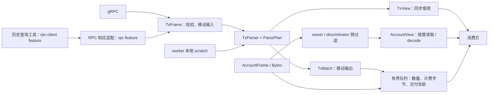

# 事件解析与流处理性能架构

- 状态：交易批次、同步内核、按需解析、账户视图与有界交付已实现；接口为未发布的破坏性变更。
- 日期：2026-09-09。
- 比较基线：`a63f80f`（`performance optimize`）；原方案文档提交：`41878e0`。
- 使用方式：[中文迁移指南](../MIGRATION_CN.md) / [English migration guide](../MIGRATION.md)。

核心设计：**交易批次拥有公共数据，事件通过索引访问输入，按消费需求解析；同步解析内核与异步 I/O 分离。** 用户允许使用方配合迁移，因此实现没有保留会展开元数据和复制输入的旧接口适配器。

## 1. 数据流与所有权



| 组件 | 实现与职责 |
| --- | --- |
| [TxFrame / InstructionAccounts](../src/streaming/event_parser/core/frame.rs) | gRPC 与 SDK 输入共用校验后的公钥表和指令序列；移动 Vec，不依赖 RPC 响应类型 |
| [TxEvent / AccountEvent](../src/streaming/event_parser/core/traits.rs) | 交易与大账户快照分离，不让账户数组决定交易 Vec 的元素尺寸 |
| [TxBatch / TxView](../src/streaming/event_parser/core/batch.rs) | 公共元数据保存一次；拥有或借用同一数据模型；原始指令按位置访问 |
| [ParsePlan](../src/streaming/event_parser/core/plan.rs) | 协议/事件位图，构造前过滤；可选解析与内部依赖 |
| [TxParser](../src/streaming/event_parser/core/event_parser.rs) | 同步、无全局交易状态；复用事件、日志索引、解码和开发者暂存 |
| [InvocationIndex](../src/streaming/event_parser/common/program_data_index.rs) | 一次日志扫描，同时服务 Program Data 与 CU；只存日志位置，复用解码缓冲区 |
| [AccountView](../src/streaming/event_parser/core/account_event_parser.rs) | 预过滤、边界检查的标量读取、显式快照解码 |
| [交付队列](../src/streaming/common/event_queue.rs) | 批次移动交付，限制积压，显式错误和排空规则 |
| [gRPC worker](../src/streaming/yellowstone_grpc.rs) | 一个有序收流/解析任务，处理控制更新、ping、停止和每客户端指标 |

原有 Shred 功能保持移除；旧全局交易缓存、对象池与逐事件 metrics 回调适配器也已删除。

### RPC 依赖边界

默认构建只包含 gRPC 与纯解析。核心 `TxFrame` 不再导入 RPC 响应类型，也不提供 `from_rpc` 方法。独立的 [rpc 模块](../src/rpc/mod.rs)通过 feature 选择：

| 构建 | 入口与依赖 |
| --- | --- |
| 默认 | gRPC 订阅、账户解码、`TxParser`、`TxFrame::from_versioned`；无 Solana HTTP RPC 客户端 |
| `rpc` | `rpc::transaction_frame` 和 RPC 辅助解析，使用 `solana-transaction-status-client-types`；无 HTTP 客户端 |
| `rpc-client` | 包含 `rpc`，提供 HTTP 客户端及查询配置；[历史查询示例](../examples/parse_tx_events.rs)要求此 feature |

HTTP 请求仍由示例或调用方执行；响应转换后移动进同一 `TxFrame`。`solana-client` 总包、nonce RPC 工具以及完整 `solana-transaction-status` 已从直接依赖移除。核心的 `solana-account-decoder` 用于本地 nonce 账户解码，不发起 RPC 请求。

本轮拆分的依赖树检查（同一锁定解析结果、当前目标，`cargo tree -e normal`，按包名和版本去重，不计根包、开发和构建依赖）：

| 配置 | 常规依赖包数 | Solana RPC 客户端 / reqwest | RPC 交易响应类型 |
| --- | ---: | --- | --- |
| 拆分前 | 602 | 有 | 有 |
| 默认 | 448 | 无 | 无 |
| `rpc` | 459 | 无 | 有 |
| `rpc-client` | 509 | 有 | 有 |

三种新配置均不再包含 `solana-client`、`solana-tpu-client`、`solana-quic-client` 或 `solana-rpc-client-nonce-utils`。包数随平台和依赖版本变化，不能直接换算为编译时间或运行内存收益。Cargo.lock 可以记录未启用的可选依赖，是否参与构建应以选定 feature 的依赖树为准。

拆分验证已通过：默认 36 项测试、`rpc` 下 3 项响应适配测试、默认 19 个 gRPC 示例构建，以及 `rpc-client` 下全部 20 个示例构建。默认开发依赖树也不包含 RPC 客户端或 RPC 交易响应类型，测试依赖没有绕过 feature 边界。

## 2. 布局与复制变化

同一 `rustc 1.97.1`、`x86_64-unknown-linux-gnu` 环境下的 `size_of`：

| 对象 | 基线 | 当前实现 |
| --- | ---: | ---: |
| 交易事件枚举 | `DexEvent`：11,744 B | `TxEvent`：1,136 B |
| 每事件元数据 | 312 B | 80 B |
| 20 个交易事件的元素存储 | 234,880 B | 22,720 B |
| 独立账户事件枚举 | 与交易共用 | 11,520 B |

交易事件元素存储减少约 **90.3%**；这个数字不含 Vec/String 的额外堆内存、分配器开销，也不表示吞吐、延迟或进程 RSS 改善 90.3%。类型布局随编译器和目标平台变化，回归测试会重新检查。

| 数据 | 当前处理方式 | 仍然存在的成本 |
| --- | --- | --- |
| signature / slot / 时间 / 交易索引 | 一次存于 `TxMetadata` | 移动 Rust 值不保证机器码完全没有字节搬运 |
| static + loaded 公钥 | 一次构造交易公钥表 | protobuf 的字节公钥需要校验并转成 Pubkey |
| 每指令账户列表 | `InstructionAccounts` 投影 | 业务字段中的必要 Pubkey 标量仍按值存储 |
| remaining accounts | 保存 u8 索引，解析时使用批次公钥表 | 输出 Vec 仍可能需要分配 |
| 原始指令 data / account indices | 从 protobuf 或 SDK 移动进 frame，再移动进 owned batch | 扁平指令头数组需要分配；不复制 data 内容 |
| 通用 modeled instruction | 通过 `instruction_index` 访问 source | 此类批次即使关闭 raw 选项也需保留源指令 |
| Program Data | 索引只存日志序号与链，不复制 Base64 字符串；每项解码一次 | Base64 解码仍写入 worker 缓冲区，业务观测输出可分配 |
| 账户 data | Yellowstone `account-data-as-bytes` + 端到端 `Bytes` | 共享引用计数以及全量快照解码；共享切片可能保留更大底层内存 |
| 余额审计 / 分类 | 显式选择后执行 | 审计字符串、关联表、分类临时结构有分配成本 |
| 拥有型跨线程交付 | 移动整个批次 | 队列调度和字节额度共享句柄；消费者保留批次会延长其内存寿命 |

`TxView::to_owned()` 是使用方主动请求复制的便利方法，不在无临时复制路径内。需要长期保存少数字段时，应提取紧凑业务结果，避免仅为一个字段长期保留完整批次。

## 3. 解析语义与依赖

默认只解码指令与必要 CPI 事件。日志补充、CU、raw/log 保留、余额审计、计算预算汇总、Jito 与交易分类分别配置。未计算的 summary 字段为 `None`；源数据缺少执行证据时为 `Unknown`。

过滤先于事件构造，并保留内部依赖：

- PumpFun/Bonk 的 create 可作为同交易后续 trade 的开发者标记依赖，即使 create 不输出。
- 计算预算汇总不要求单独输出 ComputeBudget 事件。
- 交易分类需要选中协议的完整序列，分类之后才执行最终输出过滤。
- 通用 instruction 事件必须能访问自己的原始输入，因此自动保留 source；其他事件的 remaining 索引只依赖批次 keys。

`TxFrame` 按 outer 后跟对应 inner 排列指令。每条事件同时保存扁平序号和原始 outer/inner 位置。CPI 合并检查程序与事件类型，并在已知调用栈边界处停止，避免把相邻 swap 的 CPI 结果合并到当前事件。缺少 stack height 时，遇到同程序下一条普通指令停止；不猜测它属于当前调用。

账户公钥、程序索引和账户索引先验证，非法键不能跳过后压缩数组。协议字段读取保留长度检查，短账户列表返回无法解码而不是越界。

## 4. 调用与日志索引

统一扫描跟踪 program、深度、指令位置、退出与 CU，每条 Program Data 只保存所属调用及原日志序号。每个调用通过索引链访问全部数据，第一项不再单独复制、单独扫描。

默认省略日志的 ComputeBudget 和预编译指令可以跳过；显式存在的对应调用日志也能匹配。重复调用同一程序和重入按位置关联；不匹配或缺失退出导致归属不明确时，不向未完成调用填充日志/CU。已完成子调用的独立证据可以保留。失败调用的退出本身可确认观测归属，交易执行状态仍独立记录。

worker 的临时容量有上限，交易结束后释放超限缓冲区。默认最多保留 64 个事件、512 个调用索引、1,024 个 Program Data 索引、64 KiB 解码字节与每类 32 个开发者公钥。上限约束保留容量，不拒绝超过这些数量的合法交易。`parse_owned` 移交后的输出 Vec 归消费者所有，不能继续作为 worker scratch 使用。

拥有型输出记录上次的事件数量作为下次容量提示，受 `ScratchLimits.events` 和当前指令数量约束；只有实际产生事件时才分配。相似交易可减少 Vec 扩容及元素搬运。提示可能高于本次实际输出，队列按实际容量计费；全过滤路径不会为提示预分配。

## 5. 交付、指标与失败

| 模式 | 行为与边界 |
| --- | --- |
| `subscribe` / `visit` | 同步借用；不创建每交易 Arc 回调。消费者的慢回调直接影响收流，适合有界快速处理 |
| `subscribe_queued` / `parse_owned` | 移动批次；消费者可跨 await 持有；单 worker 保持当前流的接收顺序 |
| 队列容量或计费字节超限 | 立即停止订阅，先排空已接受项，再返回错误；不静默丢弃或无限等待 |
| 交付年龄超限 | 返回错误，关闭并清空队列；接收者关闭使生产者退出 |
| `stop` | 等待当前同步处理，关闭生产者；已接受的队列项仍可排空 |
| 动态订阅 | worker 在消息间替换完整 plan 并发送对应请求；完成信号确认已发送，不代表服务端精确生效边界 |
| 指标关闭 | 不执行指标计数，不创建指标回调/每交易指标 Arc |
| 指标开启 | worker 本地累积，每 128 个交易/账户/区块更新或 1 秒合并到每客户端快照；处理耗时包含同步交付，不含 ping 网络等待 |

默认队列为 256 项、64 MiB 计费载荷、5 秒最大交付年龄。字节 permit 由 envelope 持有，出队不释放；消费者完成后丢弃 envelope 才归还额度。计费不等于 RSS 硬上限：还应考虑 protobuf 解码、分配器/通道以及 `Bytes` 底层共享缓冲区。`connection.max_decoding_message_size` 对单条网络消息另设限制。

自动重连、跨连接去重、slot 回滚处理和持久化补数由应用决定。当前实现不暗中丢事件、不承诺网络故障后无缺口。

## 6. 验证与回放

- [历史协议夹具](../tests/fixtures/protocol_baseline.json)：改动前库生成的 48 个结果，覆盖全部 10 个协议。对照仅规范化元数据位置、账户索引和 raw 表示；DLMM 通用指令修正为独立事件类型，避免沿用默认 PumpSwapBuy。
- [黄金结果对照](../tests/protocol_golden.rs)：业务字段、前置事件类型选择、通用事件原始输入、布局与短输入边界。
- [所有权/语义/分配回归](../tests/parser_ownership.rs)：公共元数据、加载地址、原始缓冲区指针、SDK/gRPC 顺序、失败状态与审计、过滤依赖、CPI 合并、日志归属与截断、账户 Bytes 共享。
- [可选 RPC 适配测试](../tests/rpc_adapter.rs)：启用 `rpc` 后核对 gRPC/历史响应的一致性、原始输入、加载地址、审计、失败与未知状态、非法响应。
- [队列测试](../src/streaming/common/event_queue.rs)：容量、字节额度、出队后保留额度、过期错误与排空。
- [本地 gRPC 测试](../tests/example_stream_shutdown.rs)：动态更新与 FnMut、后台失败、回调 panic、队列超载、停止后排空、接收者关闭和每客户端指标。
- [release 回放工具](../benches/parser_replay.rs)：固定协议夹具与 20 CPI 输入；同时测量借用、拥有和排除路径，计时和分配计数分开运行。

复现命令：

```bash
cargo test
cargo test --features rpc --test rpc_adapter
cargo build --examples                # 19 个 gRPC 示例
cargo build --examples --features rpc-client # 包括历史查询，共 20 个
cargo bench --bench parser_replay
# 可调整每种场景回放数量
REPLAY_ITERS=50000 cargo bench --bench parser_replay
```

回放排除网络与 frame 构造，使用预热后的同步解析器；输出每 frame 的 p50/p95/p99、平均耗时、分配次数和分配字节。分配数字不包括消费者主动克隆与输入解码。合成夹具可检测结构回归，不能替代真实主网流量的吞吐、排队尾延迟和 RSS 测量。

回归夹具中，48 个公钥的归一化仅分配一次、共 1,536 B；三种 gRPC 包装转换不额外分配载荷；预热后的 modeled 交易/未匹配 CPI 借用解析与提前过滤为零堆分配。这些结果只针对对应夹具和测量范围。

### 本次 release 回放记录

[完整 JSON](performance-replay.json)记录输入校验值、编译器、平台与测量范围。使用上述编译器，在可见 3 CPU 的 Skylake 环境中，每种场景运行 50,000 个 frame；计时不含网络、输入构造和消费者处理。拥有型输出的析构也在计时之外。宿主调度和 CPU 频率未隔离，耗时会波动。

| 场景 | 平均 ns/frame | p50 / p95 / p99 ns | 分配次数/frame | 申请字节/frame |
| --- | ---: | ---: | ---: | ---: |
| 48 协议用例轮转 / 借用 | 294 | 260 / 526 / 781 | 0.22912 | 11.19 |
| 20 CPI / 借用 | 3005 | 2600 / 4324 / 5134 | 0.00000 | 0.00 |
| 48 协议用例轮转 / 全过滤 | 85 | 86 / 96 / 154 | 0.00000 | 0.00 |
| 48 协议用例轮转 / 拥有 | 574 | 540 / 800 / 1033 | 1.20828 | 1123.51 |
| 20 CPI / 拥有 | 3100 | 2734 / 4798 / 5331 | 1.00000 | 22720.00 |

20 CPI 的借用路径在预热后零分配；拥有型路径每个批次分配一次事件 Vec、22,720 B，输入指令缓冲区继续移动。协议混合场景仍可能分配 remaining 索引、字符串等业务字段，因此没有宣称所有协议零分配。申请字节统计 alloc/realloc 请求，不是复制字节或保留 RSS。

批次架构回放时，`cargo test --offline` 通过 36 项测试，包含 48 个历史业务解码用例，并编译了当时的全部 20 个示例。RPC 拆分后，默认示例构建包括 19 个 gRPC 示例，历史查询需显式开启 `rpc-client`；RPC 适配回归也通过 `rpc` 单独启用。没有用当前回放耗时推算相对旧版本的吞吐提升，因为旧版本缺少相同范围的 release 计时基线。

实际运行验证使用本地 gRPC 模拟服务：`grpc_example`、`queued_subscription`、`token_balance_listen_example` 与 `dynamic_subscription` 均正常退出，前三项核对了交易/账户输出，动态示例确认 10 秒后发送了第二份订阅请求。

## 7. 后续可选设计

以下部分仍以 profiling 为前提，不属于本次基础架构的必需依赖：

1. **多 worker 纯解析**：只有单核解析被证明成为瓶颈时启用。按交易派发，序号记录接收顺序，状态应用前设有界重排与缺口规则；不能让快 worker 越过尚未完成的前序交易。
2. **定制 protobuf 字节字段与 codec**：如果 profile 显示逐字段分配占主导，再扩展交易 data/key 的 Bytes 配置。账户的现有 feature 不自动使所有交易字段零复制；需要测量解码器输入、切片寿命与底层缓冲区保留。
3. **生产端裁剪或专用格式**：仅在可控制服务端时评估。先按订阅裁剪无关字段，再考虑平坦事件编码或共享内存；消费者不能单方面替换服务端协议。
4. **账户局部布局访问与缓存**：当前提供通用安全标量读取。可针对热点账户增加具名布局视图；缓存以账户版本为边界，不能用未校验的指针转换映射 Rust 结构体。
5. **业务状态层**：跨交易池状态、回滚、补数与持久化与同步内核分离。保留确定性的纯解析入口，便于回放、比较与更换调度方式。

生产验收应固定输入及机器/编译器参数，同时测量适配、索引、解码、交付各段 CPU/分配，端到端 p50/p95/p99、队列最老项年龄、超载错误和 RSS。特别关注大型账户快照、深 CPI、长日志及慢消费者；不从类型尺寸推算生产吞吐百分比。
